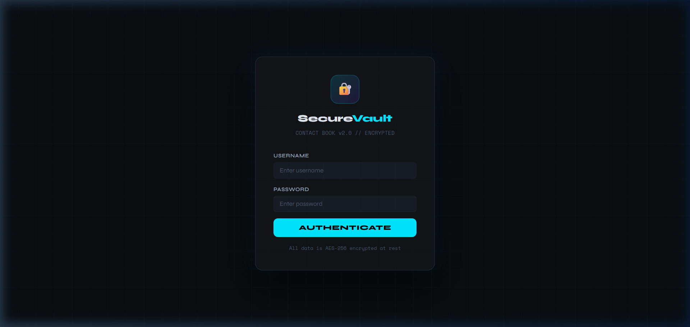
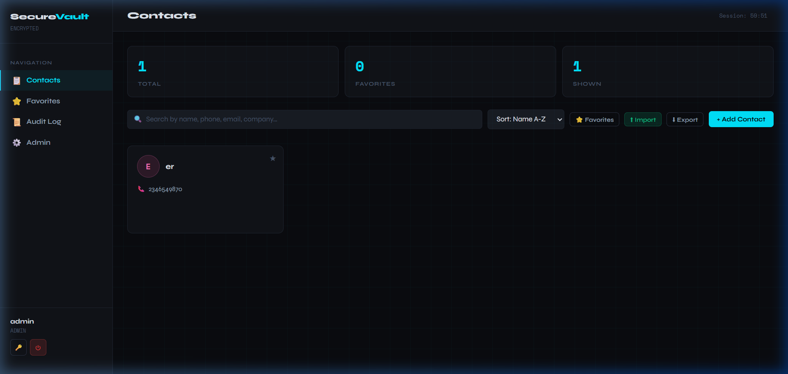
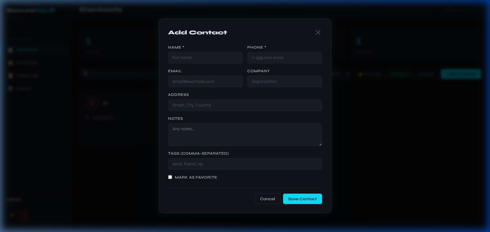
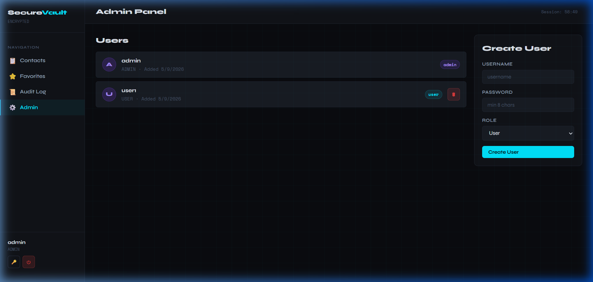
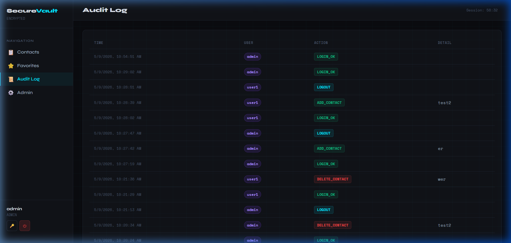

<p align="center">
  
</p>

<p align="center">
  
  
  
  
  
</p>

<h3 align="center">A production-grade encrypted contact manager — full-stack web app with AES-256 field encryption, JWT authentication, multi-user isolation, and a sleek dark UI.</h3>

---

##  Screenshots

###  Login Page
<p align="center">
  
</p>

###  Contacts Dashboard
<p align="center">
  
</p>

###  Add Contact Modal
<p align="center">
  
</p>

###  Admin Panel
<p align="center">
  
</p>

###  Audit Log
<p align="center">
  
</p>

---

##  What's New in v2

| Feature | v1 (Basic) | v2 (Advanced) |
|---|---|---|
| **UI** | Tkinter desktop | Modern web app (any browser) |
| **Auth** | SHA-256 + plain session | JWT tokens + PBKDF2-HMAC (260k iterations) |
| **Session** | 60s timer thread | JWT expiry + live countdown |
| **Contact fields** | Name, Phone only | + Email, Address, Company, Notes |
| **Organisation** | None | Tags, Favorites, Sorting |
| **Search** | Name/phone only | Multi-field (name, phone, email, company) |
| **Pagination** | None | Paginated list + Load More |
| **Import/Export** | TXT export only | CSV import + export |
| **Audit Log** | None | Full CRUD audit trail (last 500 events) |
| **Multi-user** | Single user | Admin can create/delete users with roles |
| **Data Isolation** | Shared | Each user sees only their own contacts |
| **Rate Limiting** | None | In-memory rate limiter (login: 10/min) |
| **Input Validation** | None | Phone regex, email format, length limits |
| **Duplicate Check** | Name+Phone | Case-insensitive name+phone per user |
| **API** | Basic Flask | RESTful JSON API with JWT Bearer auth |

---

##  Quick Start

```bash
# 1. Install dependencies
pip install -r requirements.txt

# 2. Run setup (creates key, admin account, databases)
python setup.py

# 3. Start the server
python app.py

# 4. Open in browser
# http://localhost:5000
```

Default credentials (if you skip setup): **admin / admin123**

---

##  Project Architecture

### Directory Structure

```
secure_contact_book_v2/
├── app.py            # Flask backend — all API routes & business logic
├── crypto_util.py    # Encryption & password hashing utilities
├── setup.py          # First-run setup wizard
├── requirements.txt  # Python dependencies
├── key.key           # Fernet encryption key (auto-generated) ⚠ BACK UP
├── user_db.json      # User accounts (passwords PBKDF2-hashed)
├── contact_db.json   # Encrypted contact records
├── audit_log.json    # Audit trail (last 500 entries)
└── static/
    ├── index.html    # Single-page frontend (HTML + CSS + JS, no framework)
    └── screenshots/  # README screenshots
```

### Layer Overview

```
┌─────────────────────────────────────────────────────────┐
│                    Browser (Client)                     │
│           static/index.html  ·  Vanilla JS SPA          │
│   Login · Dashboard · Add/Edit · Admin · Audit Log      │
└────────────────────┬────────────────────────────────────┘
                     │  HTTP/JSON  (Bearer JWT)
                     ▼
┌─────────────────────────────────────────────────────────┐
│               Flask REST API  (app.py)                  │
│                                                         │
│  ┌──────────────┐  ┌─────────────┐  ┌───────────────┐   │
│  │  Auth Layer  │  │  Business   │  │  Admin Layer  │   │
│  │  /api/login  │  │   Logic     │  │ /api/admin/*  │   │
│  │  /api/logout │  │ /api/       │  │  (role guard) │   │
│  │  JWT verify  │  │ contacts/*  │  └───────────────┘   │
│  └──────────────┘  └─────────────┘                      │
│        │                 │                              │
│        ▼                 ▼                              │
│  ┌──────────────────────────────────────────────────┐   │
│  │           Data & Crypto Layer                    │   │
│  │             (crypto_util.py)                     │   │
│  │  PBKDF2-HMAC password hash · Fernet field enc    │   │
│  └──────────────────────────────────────────────────┘   │
│        │                                                │
└────────┼────────────────────────────────────────────────┘
         │  File I/O (JSON)
         ▼
┌────────────────────────────────────────────────────────┐
│                  Persistent Storage                    │
│   user_db.json · contact_db.json · audit_log.json      │
│   key.key (Fernet symmetric key)                       │
└────────────────────────────────────────────────────────┘
```

### Component Responsibilities

| Component | File | Responsibility |
|---|---|---|
| **SPA Frontend** | `static/index.html` | Renders all UI views, manages JWT in memory, calls REST API |
| **API Server** | `app.py` | Route handling, input validation, auth guards, rate limiting, audit logging |
| **Crypto Utilities** | `crypto_util.py` | Fernet encryption/decryption, PBKDF2 password hashing, token generation |
| **Setup Wizard** | `setup.py` | First-run key generation, default admin creation, DB initialisation |
| **User Store** | `user_db.json` | User accounts with PBKDF2-hashed passwords and role assignments |
| **Contact Store** | `contact_db.json` | AES-encrypted contact records with per-user ownership metadata |
| **Audit Store** | `audit_log.json` | Timestamped CRUD event trail (capped at 500 entries) |
| **Encryption Key** | `key.key` | Fernet symmetric key used for all field-level contact encryption |

---

##  Application Workflow

### 1. First-Run Setup

```
python setup.py
       │
       ├─► Generate Fernet key → key.key
       ├─► Prompt for admin username & password
       ├─► Hash password (PBKDF2-HMAC-SHA256, 260k iterations, random salt)
       ├─► Write admin record → user_db.json
       └─► Initialise empty contact_db.json & audit_log.json
```

### 2. User Authentication Flow

```
Browser                          Flask API                      Storage
  │                                  │                              │
  │── POST /api/login ──────────────►│                              │
  │   {username, password}           │── load user_db.json ────────►│
  │                                  │◄─ user record ───────────────│
  │                                  │                              │
  │                                  │── check_password()           │
  │                                  │   (PBKDF2 verify or          │
  │                                  │    legacy SHA-256 migrate)   │
  │                                  │                              │
  │                                  │── rate_limit check (10/min)  │
  │                                  │                              │
  │                                  │── create_token()             │
  │                                  │   (HS256 JWT, 1hr expiry)    │
  │                                  │                              │
  │◄─ 200 {token, role, expires} ─── │                              │
  │                                  │── append_audit("login") ────►│
  │                                  │                              │
  │  [Store JWT in memory]           │                              │
  │  [Start countdown timer]         │                              │
```

### 3. Contact CRUD Workflow

```
Browser                          Flask API                      Storage
  │                                  │                              │
  │── GET /api/contacts?q=... ──────►│                              │
  │   Authorization: Bearer <JWT>    │── decode_token() verify      │
  │                                  │                              │
  │                                  │── load contact_db.json ─────►│
  │                                  │◄─ encrypted records ─────────│
  │                                  │                              │
  │                                  │── decrypt_contact() each     │
  │                                  │   (Fernet field decryption)  │
  │                                  │                              │
  │                                  │── filter by owner_username   │
  │                                  │── apply search/tag/sort/page │
  │                                  │                              │
  │◄─ 200 {contacts[], total} ────── │                              │
  │                                  │                              │
  │── POST /api/contacts ───────────►│                              │
  │   {name, phone, email, ...}      │── validate_contact()         │
  │                                  │── duplicate check (per-user) │
  │                                  │── encrypt_contact()          │
  │                                  │   (Fernet on 6 fields)       │
  │                                  │── append to contact_db.json ►│
  │                                  │── append_audit("add") ──────►│
  │◄─ 201 {contact} ─────────────────│                              │
```

### 4. Data Encryption Workflow

Every contact write goes through field-level encryption before hitting disk:

```
Raw Contact Data
  {name: "Alice", phone: "+44...", email: "alice@...", ...}
            │
            ▼
    encrypt_contact()  ◄── Fernet key (loaded from key.key)
            │
            │  Fernet(key).encrypt(field.encode())
            │  applied individually to:
            │  name · phone · email · address · company · notes
            │
            ▼
Encrypted Contact Record (stored in contact_db.json)
  {name: "gAAAAAB...", phone: "gAAAAAB...", email: "gAAAAAB...", ..
   id: "uuid", owner: "alice", tags: [...], favorite: false}
            │
            │  On read: decrypt_contact() reverses each field
            ▼
Plaintext returned to authenticated user only
```

### 5. Request Lifecycle (every protected endpoint)

```
Incoming Request
       │
       ▼
  @require_auth decorator
       │
       ├─► Extract "Authorization: Bearer <token>" header
       ├─► decode_token() — verify HS256 signature & expiry
       │
       ├── FAIL → 401 Unauthorized
       │
       └── PASS → inject {username, role} into request context
                       │
                       ▼
              Route Handler
                       │
                       ├─► Input validation (validate_contact / manual checks)
                       ├─► Ownership enforcement (filter by username)
                       ├─► Business logic
                       ├─► Crypto operations (encrypt/decrypt)
                       ├─► Persist to JSON store
                       └─► append_audit(action, detail)
                                   │
                                   ▼
                          JSON Response → Browser
```

### 6. Admin Workflow

```
Admin User                       Flask API
  │                                  │
  │── GET /api/admin/users ─────────►│
  │   Authorization: Bearer <JWT>    │── @require_admin decorator
  │                                  │   checks role == "admin"
  │                                  │── load user_db.json
  │◄─ 200 [user list] ───────────────│
  │                                  │
  │── POST /api/admin/users ────────►│── validate new username
  │   {username, password, role}     │── hash_password()
  │                                  │── save to user_db.json
  │◄─ 201 {created} ─────────────────│── append_audit("admin_create_user")
  │                                  │
  │── DELETE /api/admin/users/:u ───►│── prevent self-deletion
  │                                  │── remove from user_db.json
  │◄─ 200 {deleted} ─────────────────│── append_audit("admin_delete_user")
```

---

## 🛡️ Security Model

### Password Hashing
- **Algorithm**: PBKDF2-HMAC-SHA256 with a random 32-byte salt
- **Iterations**: 260,000 (OWASP 2024 minimum recommendation)
- **Legacy**: Old SHA-256 hashes are accepted and auto-migrated on next login

### Contact Encryption
- **Algorithm**: Fernet (AES-128-CBC + HMAC-SHA256)
- **Scope**: All sensitive fields encrypted individually at rest: name, phone, email, address, company, notes
- **Key**: Stored in `key.key` — losing this file means losing all data

### Session / JWT
- **Type**: HS256 JWT, signed with a random secret generated at startup
- **Expiry**: 1 hour (configurable via `JWT_EXPIRY` in `app.py`)
- **Transport**: Bearer token in `Authorization` header — no cookies, no CSRF risk

### Data Isolation
- Each user can **only see, add, edit, and delete their own contacts**
- Admin users have additional access to the user management panel
- Duplicate detection is scoped per-user

### Rate Limiting
- Login endpoint: 10 attempts per 60 seconds per IP
- Backed by in-memory dict; swap for Redis in production

---

##  API Reference

All endpoints (except `/api/login`) require:
```
Authorization: Bearer <token>
```

| Method | Endpoint | Description |
|---|---|---|
| POST | `/api/login` | Authenticate, get JWT |
| POST | `/api/logout` | Invalidate session (audit log) |
| POST | `/api/change-password` | Change own password |
| GET | `/api/contacts` | List contacts (query, sort, paginate, filter) |
| GET | `/api/contacts/:id` | Get single contact |
| POST | `/api/contacts` | Add contact |
| PUT | `/api/contacts/:id` | Update contact |
| DELETE | `/api/contacts/:id` | Delete contact |
| POST | `/api/contacts/:id/favorite` | Toggle favorite |
| GET | `/api/contacts/export/csv` | Export all contacts as CSV |
| POST | `/api/contacts/import/csv` | Import contacts from CSV |
| GET | `/api/audit` | Paginated audit log |
| GET | `/api/admin/users` | List users (admin only) |
| POST | `/api/admin/users` | Create user (admin only) |
| DELETE | `/api/admin/users/:username` | Delete user (admin only) |

### Query Parameters for `GET /api/contacts`
| Param | Example | Description |
|---|---|---|
| `q` | `q=john` | Full-text search |
| `tag` | `tag=work` | Filter by tag |
| `favorites` | `favorites=true` | Favorites only |
| `sort` | `sort=name` | Sort field: `name`, `created` |
| `order` | `order=desc` | `asc` or `desc` |
| `page` | `page=2` | Page number |
| `per_page` | `per_page=30` | Results per page (max 200) |

---

## ✅ Production Checklist

- [ ] Set `JWT_SECRET` environment variable instead of auto-generated
- [ ] Disable Flask debug mode (`debug=False` is already set)
- [ ] Serve with a production WSGI server (gunicorn, waitress)
- [ ] Put behind HTTPS (nginx/Caddy reverse proxy)
- [ ] Back up `key.key`, `user_db.json`, `contact_db.json` regularly
- [ ] Replace in-memory rate limiter with Redis for multi-process deployments
- [ ] Set `SESSION_COOKIE_SECURE = True` if adding cookie-based auth

---

##  CSV Import Format

```csv
name,phone,email,address,company,notes,tags,favorite
Alice Smith,+44 7700 000001,alice@example.com,"London, UK",ACME Corp,VIP client,work|vip,true
Bob Jones,+1 555 000 0000,bob@example.com,,Freelance,,friend,false
```

- **tags**: pipe-separated (`work|vip|friend`)
- **favorite**: `true` or `false`
- All fields except `name` and `phone` are optional

Thanks for reading 
Built with Python, Flask, and ❤️
